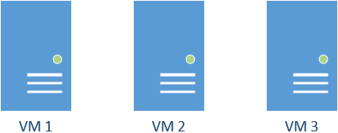
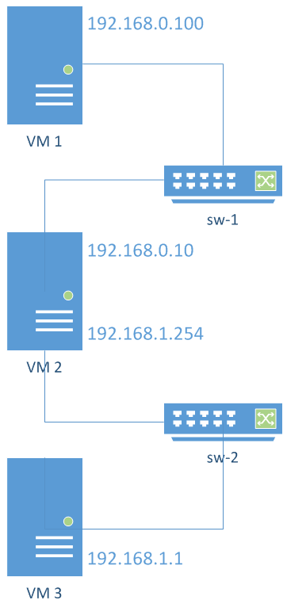
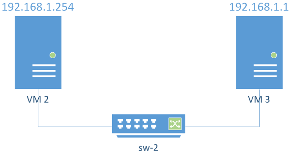

Instituto Superior Técnico, Universidade de Lisboa

**Network and Computer Security**

# Lab guide: Implementation and Analysis of a Virtual Computer Network

## Goals

- Implement and test a virtual computer network.
- Perform a simple TCP/IP packet analysis.

## 1. VirtualBox/VMWare Fusion vs rnl-virt

The setup of the machines for this lab is different depending on the usage of VirtualBox or VMWare on your machine, or the usage of RNL's rnl-virt system. 
Follow section 1.1 or 1.2 accordingly.

<p align="center">
    
</p>

*Figure 1. In this laboratory assignment, you will need to create three virtual machines, which will be used to explore communication inside virtual networks and to test packet forwarding.*

## 1.1. Setup the lab for VirtualBox or VMWare Fusion
To set up our lab environment to be used with VirtualBox or VMWare Fusion, you need to have 3 instances of your VMs. You can find the instructions to create them in the [setup lab-guide](https://github.com/tecnico-sec/Setup/blob/master/kali.org_VirtualBox.pdf).
* Use the instructions for VirtualBox if you are on Windows, Linux or macOS (Intel-based);
* Use the instructions for VMWare Fusion if you are on macOS (Apple Silicon);

You can either install 2 new machines from scratch, or you can clone the existing machine (VM1). Section 1.1.1 overviews how to do this in VirtualBox, and section 1.1.2 shows the same for VMWare Fusion.

## 1.1.1. Cloning virtual machines
### 1.1.1.1. VirtualBox

If you decide to clone the existing machine you should:

- Click `Clone`
- Select the name you want to give to the new machine
- MAC Adress Policy: Generate new MAC addresses for all network adapters
- Select `Linked Clone`

Repeat this process twice and let's call the original machine VM1, and the new ones VM2 and VM3.

### 1.1.1.2. VMWare Fusion

VMWare Fusion doesn't offer cloning functionality, but you can easily create a copy of VM1:
- Find VM1's ".vmware" file at `/<User>/Virtual Machines`,
- Create two copies, name them e.g. "VM2.vmwarevm" and "VM3.vmwarevm";
- Open VMWare Fusion;
- Head to the Virtual Machine Library (⌘+⇧+L);
- Click the `+` button on the top left corner, select `Scan`. The new machines should appear in the VM list;
    - If this doesn't work, click `File` > `Open` and select the ".vmwarevm" files you created (one at a time);

## 1.1.2. Setting up the network

The intended topology of our network is shown in Figure 2, with VM2 also connected to the Internet (with an IP address obtained via DHCP).

<p align="center">
    
</p>

*Figure 2. Intended network layout. 
VM1 and VM2 are connected in a virtual network via `sw-1`. 
VM2 and VM3 are connected in another virtual network via `sw-2`. 
VM2 will operate as a gateway between the two subnets, and as a gateway to the Internet.*

### 1.1.2.1 VirtualBox

The easiest way to connect the VM1 and VM2 in the same network is to do the following in the VirtualBox interface with the VM turned off:

- Select the VM Settings/Network/Adapter1
- Attach to `Internal Network`. Call it "sw-1"
- Promiscuous Mode: Allow VMs

Repeat for VM2 and VM3 but this time creating a second Network adapter in VM2 and calling the `Internal Network` "sw-2".

Finally, create a third Network adapter in VM2 that is `nat`-ed with your physical address. 
This interface will be used to access the Internet.

Proceed now to 2.

### 1.1.2.2 VMWare Fusion

For VMWare Fusion, you need to create 2 private networks manually before attaching the adapters to your newly-created VMs.
- Close VMWare Fusion (easiest way is to click on a VMWare Fusion window and hit ⌘+Q);
- Edit the following file:
    ```
    sudo nano /Library/Preferences/VMware\ Fusion/networking
    ```
- Add the following lines to the file:
    ```plaintext
    answer VNET_2_HOSTONLY_NETMASK 255.255.255.0
    answer VNET_2_HOSTONLY_SUBNET 192.168.0.0
    answer VNET_3_HOSTONLY_NETMASK 255.255.255.0
    answer VNET_3_HOSTONLY_SUBNET 192.168.1.0
    ```
  * You can add them right after the last `answer VNET_1...` line.
  * Very important: do NOT edit anything else on this file. VMWare reserves `vmnet1` and `vmnet8` for its own use, and you should not change those.
  * In this topology, `vmnet2` represents `sw-1`, the network between VM1 and VM2, and `vmnet3` represents `sw-2`, the network between VM2 and VM3.
- Save and exit;
- Re-open VMWare Fusion and head to the Virtual Machine Library (⌘+⇧+L);
- Right-click VM1 and select `Settings`:
  - Click `Add Device` and select `Network Adapter`;
  - Select `vmvnet2`;
  - Click `Advanced Options` and hit `Generate` to generate a new MAC address for VM1;
- Right-click VM2 and select `Settings`:
  - Click `Add Device` and select `Network Adapter`;
  - Select `vmvnet2`;
  - Select `Show All` and select `Network Adapter` once again and to a second adapter, this time selecting `vmvnet3`;
  - Once again, click `Show All`, `Network Adapter`, and add a third adapter, this time selecting `Share with my Mac`, which is a NAT adapter, allowing VM2 to communicate with the Internet;
  - Click `Advanced Options` and hit `Generate` to generate a new MAC address for VM2;
- Right-click VM3 and select `Settings`:
  - Click `Add Device` and select `Network Adapter`;
  - Select `vmvnet3`;
  - Click `Advanced Options` and hit `Generate` to generate a new MAC address for VM3;

If you want to know more about this process or troubleshoot, please refer to [this guide](https://spin.atomicobject.com/2017/04/03/vmware-fusion-custom-virtual-networks/).

## 1.2. Setup the lab for rnl-virt

This guide describes how to use the RNL computers and rnl-virt, the RNL virtualization system. 
The tool’s documentation is available in [here](https://rnl.tecnico.ulisboa.pt/servicos/virtualizacao/) and should be referenced for additional command details.
rnl‑virt relies on libvirt that is based on QEMU. 
Libvirt is a special daemon used to create, launch and shutdown virtual machines. 
The physical machine is called the Host whereas the virtual machines are called Guests. 
Each guest will use a version of Ubuntu 16.04 (SEEDLabs version) with low memory requirements.

Before you begin, logon to a lab machine running Linux using your IST account (e.g. ist123456). 
You must restore and save your files for each work session.
__Use the alternative temporary folder /var/tmp for storing your work session files__. 
/var/tmp is a temporary file system directory, so files are deleted on logoff. 
However, the files are deleted only when an explicit logoff is performed, so if the machine reboots unexpectedly due to a system crash, you should be able to log again and still recover the files. 
This is not the behaviour of the temporary folder /tmp. 
For example, we recommend creating a directory whose name is based on your student number. 
So, to prepare your working environment, execute the following commands (replacing _123456_ with your own student number):

```bash
$ mkdir /var/tmp/ist123456
$ cd /var/tmp/ist123456
```

__Your home folder ~/ is not recommended for direct use in work sessions__ because it is an AFS directory with increased latency due to the distributed file system overhead. 
However you can use it to save backups of your virtual disks. 
You can also save your backups in an external USB drive.

## 1.2.1. Create the virtual networks and machines (rnl-virt)

This assignment encompasses the creation of virtual networks, for which three separate virtual machine instances will need to be created, as depicted in Figure 1. 
Each instance will have a differential disk, based on the original disk. 
The differences are stored in files.

First, we are going to create the differential disks, one for each virtual machine:

```bash
$ rnl-virt disk create sirs-1 SEED19
$ rnl-virt disk create sirs-2 SEED19
$ rnl-virt disk create sirs-3 SEED19
```

These names (sirs-1.qcow2, sirs-2.qcow2, and sirs-3.qcow2) are suggestions. They are, respectively, the disks of instance VM1, VM2 and VM3. These are the files where all changes are stored, so create backups as needed (any virtual machine you wish to backup must be shut down first).

We have created the virtual hard disks; next we will create the virtual machine instances named VM1, VM2 and VM3. But before we do so, we must take note: we are going to create two networks: one between VM1 and VM2 and another between VM2 and VM3, as can be seen in Figure 2. 
Since we are using the rnl-virt system, we must create virtual switches, one per network/subnet. 
These switches need to be associated to the virtual machines before they start running, so we shall create the switches now:

```bash
$ rnl-virt switch create sw-1 --hub
$ rnl-virt switch create sw-2 --hub
```

The hub option means that the virtual frames are broadcast in the network. 
This is important whenever you want a machine in a network to be able to capture the traffic between two other machines of the network, e.g., suppose a VM4 connected to `sw-1`. 
VM4 would be able to capture the traffic between VM1 and VM2.
If we used normal switches rather than hubs, packets would not be broadcast but rather sent only to their specific destination.

This will have created virtual switches `sw-1` and `sw-2` (again, these names are suggestions). 
Now that both the differential disks and the switches exist, we must create the virtual machine instances, associating each one to its target disk file and switch:

```bash
$ rnl-virt vm create VM1 SEED19 sirs-1.qcow2 --switch sw-1
$ rnl-virt vm create VM2 SEED19 sirs-2.qcow2 --switch sw-1 sw-2 --nat
$ rnl-virt vm create VM3 SEED19 sirs-3.qcow2 -switch sw-2
```

Notice that VM2 was associated to both virtual switches: it shall be connected to both subnets and it will later on be configured as a gateway to allow communication between VM1 and VM3, and between VM1/VM3 and the internet.
Next step, we must start and open each of the virtual machine instances. 
However, when we open the graphical interface of a virtual machine, the terminal gets blocked, so we must open new terminal tabs (on the RNL computer that is being used) and, for each tab, open a specific virtual machine:

```bash
$ rnl-virt vm start VM1
$ rnl-virt vm open VM1
```

`<CTRL+SHIFT+T>` to open a new terminal tab

```bash
$ rnl-virt vm start VM2
$ rnl-virt vm open VM2
```

`<CTRL+SHIFT+T>` to open a new terminal tab

```bash
$ rnl-virt vm start VM3
$ rnl-virt vm open VM3
```

If you are asked to login, do it with user `seed` and password `dees` on each virtual machine.

### 1.2.2. Useful shortcuts

```bash
* CTRL+ALT     – release mouse.
* CTRL+ALT+F   – maximize window.
* CTRL+ALT+SHIFT+2/1 – open/close the QEMU console.
```

To shut down the virtual machine, open a terminal/shell inside the virtual machine and execute the following command:

```bash
$ sudo /sbin/poweroff
```

## 2. Configure the machines to use the virtual networks

We will now configure the machines to the virtual network that connects VM1 to VM2 and the one that connects VM2 and VM3.

### 2.1. Configure the virtual network for VM1 and VM2

We will now configure the IP network (supported by virtual switch `sw-1`) with static IP addresses. 
VM1 and VM2 will talk using a subnet. 
We will use the private IP addresses 192.168.0.0/24 (meaning that the subnet mask is 255.255.255.0 – we can have 254 addresses to use (from 192.168.0.1 to 192.168.0.254). 
Note that 192.168.0.255 is reserved for broadcast).
Figure 3 presents an overview of the desired configuration. 
The IP address of VM1 will be 192.168.0.100 and VM2 will be 192.168.0.10. 
The values ending with 100 and 10 are arbitrary, they could be any (different) value between 1 and 254.

<p align="center">
    
</p>

*Figure 3 Expected layout of the subnet in which VM1 and VM2 will communicate using `sw-1`.*

Follow the configuration procedure below for both VM1 and VM2.

We are assuming that VM1 has an interface `eth0` (connected to `sw-1`) and VM2 has interfaces `eth0` (connected to `sw-1`), `eth1` (connected to `sw-2`), and `eth2` (connected to the internet). 
These `eth...` values are the network interface names and are automatically assigned by the operating system, so they may be different in your case.

Given this, it's a good idea to take note and map each interface to each switch as you complete the guide.
- For VM1, the mapping is simple:
  - `eth0` is connected to `sw-1`
- For VM3, it's the same case:
  - `eth0` is connected to `sw-2`
- For VM2, the mapping is a bit more complex:
  - `eth0` should be connected to `sw-1`;
  - `eth1` should be connected to `sw-2`;
  - `eth2` should be connected to the internet;
  - But this may not always be the case, so try to switch these around if you're not being successful.

<!-- TODO: This isn't true for VMWare -->
_How do you know which interface is connected to `sw-1` and which one is connected to `sw-2`? 
Look at their MAC Addresses. 
Running `ip a` shows the MAC address of each interface and you can compare with those of VirtualBox._

First, assign an IP address to VM1 on interface `eth0`.

```bash
$ sudo ifconfig eth0 192.168.0.100/24 up
```

And do the same for VM2 (again, note that the interface name may be different)

```bash
$ sudo ifconfig eth0 192.168.0.10/24 up
```

Now running `ifconfig` on the VMs should show the respective assigned IP addresses on interface `eth0`. 
If not, try to reload the network interfaces of both VM1 and VM2:

```bash
$ sudo systemctl restart NetworkManager
```

To check that the configuration is correct:

```bash
$ ifconfig
$ route
```

VM2 should now be able to ping VM1:

```bash
$ ping 192.168.0.100
```

And VM1 should be able to ping VM2:

```bash
$ ping 192.168.0.10
```

### 2.2. Configure the virtual network for VM2 and VM3

We will now configure the IP network (supported by virtual switch `sw-2`) with static IP addresses.
VM2 and VM3 will talk using another subnet. 
We will use the private IP addresses 192.168.1.0/24.
Figure 4 presents the intended configuration. 
The IP address of VM2 will be 192.168.1.254 and the address of VM3 will be 192.168.1.1. 
Again, 254 and 1 are arbitrary values between 1 and 254.

<p align="center">
    
</p>

*Figure 4 Expected layout of the subnet in which VM2 and VM3 will communicate using `sw-2`.*

In VM3, assign the IP address 192.168.1.1 to interface `eth0`. In VM2 assign the IP address 192.168.1.254 to interface `eth1` (recall that interface `eth0` of VM2 should be connected to `sw-1` and interface `eth1` of VM2 should be connected to `sw-2`).
The command `ifconfig` should define default routes for those networks. 
You can check it with command `route`.
To finish creating this network, reload the network interfaces of both VM2 and VM3:

```bash
$ sudo systemctl restart NetworkManager
```

To check that the configuration is correct:

```bash
$ ifconfig
$ route
```

VM2 should now be able to ping VM3:

```bash
$ ping 192.168.1.1
```

VM3 should now be able to ping VM2:

```bash
$ ping 192.168.1.254
```

Try to ping VM3 from VM1:

```bash
$ ping 192.168.1.1
```

It should return `Network is unreachable` because VM1 doesn’t know where to send the packets addressed at network 192.168.1.X.

### 2.3. Configure VM2 as gateway

Defining a _default gateway_ means that whenever a machine does not have a specific route for a given network, those packets are sent to its default gateway.
Since VM2 will be the default gateway for VM1, IP forwarding must be enabled in VM2. 
This will allow VM1 to communicate with machines outside its subnet 192.168.0.X.

Activate IP forwarding with:

```bash
$ sudo sysctl net.ipv4.ip_forward=1   # on VM2
```

Confirm that the flag value was updated to 1:

```bash
$ sysctl net.ipv4.conf.all.forwarding
```

Also, setup forwarding rules in VM2:

```bash
$ sudo iptables -P FORWARD ACCEPT    # Defines default policy for FORWARD
$ sudo iptables -F FORWARD           # Flushes all the rules from chain FORWARD
```

Now set VM2 as the default gateway for VM1 by doing this:

```bash
$ sudo ip route add default via 192.168.0.10   # on VM1
```

Try again to ping VM3 from VM1.

```bash
$ ping 192.168.1.1       # on VM1
```

Does it work? 
Can you identify where the problem is? 
Run the commands below and see if you understand what is happening

```bash
$ sudo tcpdump -i eth0   # on VM1
$ sudo tcpdump -i eth0   # on VM2
$ sudo tcpdump -i eth1   # on VM2
$ sudo tcpdump -i eth0   # on VM3
```

What happens now when you ping VM1 from VM3? Why is the answer different?

Add now VM2 also as the default gateway for VM3. 
This would allow VM3 to talk to machines outside its subnet 192.168.1.X.

```bash
$ sudo ip route add default via 192.168.1.254    # on VM3
```

- Can you now ping VM3 from VM1? Why? 
- And can you ping VM1 from VM3? Why?

### 2.4. Configure NAT (Network Address Translation)

Try to ping google.com from the 3 machines? Why can't you do it from VM1 nor VM3? 

The issue is that VM2 is acting as the gateway to the internet for both VM1 and VM3 but is not NATing the packets. 
If you run

```bash
$ ping 8.8.8.8                      # on VM1
$ sudo tcpdump -i eth2 -p icmp    # on VM2 (interface to the internet)
```

you can observe that the packets go out to google.com but do not come back. 
Why? 
Because google.com does not know where 192.168.0.100 is and so cannot send the packets back.
You can use the iptables command (man iptables) in VM2 to correct this behaviour. 
NAT will do the source and destination mapping.

```bash
$ sudo iptables -t nat -F            # Flushes all the rules from table NAT
$ sudo iptables -t nat -A POSTROUTING  -o eth2 -j MASQUERADE    # Creates a source NAT on interface eth2
```

Test again

```bash
$ ping 8.8.8.8                    # on VM1
$ sudo tcpdump -i eth2 -p icmp    # on VM2 (interface to the internet)
```

- What do you observe? Why does it work now? 
- What is the source address of the packet now? Compare this source address to the previous case.

Lets now go back to 2.3 to the scenario where VM2 is the default gateway for VM1 but where __VM3 has no default gateway__. 

To remove the default gateway run in VM3

```bash
$ sudo route del default    # on VM3
```

- As seen before you cannot ping VM3 from VM1. Could you solve this issue with a NAT (in interface `eth1` of VM2) instead of adding VM2 as the default gateway for VM3? Why?
- And can you ping VM1 from VM3? Why?

## 3. Monitor network traffic

To monitor the network traffic, we may use VM2 (or another machine, e.g. a VM4, also connected to the network) to run `tcpdump` and capture all network traffic. 
Make sure you can detect ICMP packets originating at VM3 and with destination VM1 (using ping). Use `tcpdump` with options `-X` and `-XX` and identify the IP addresses, MAC addresses and protocol in a given packet.
While still running `tcpdump`, open a `telnet` connection between VM1 and VM2 using user `kali` and password `kali`. 
Verify that you can capture both the username and password with `tcpdump`.

**You have successfully eavesdropped communications… But what is the difference between executing telnet from VM1 to VM3 with and without NAT (in interface `eth1` of VM2)? Use `tcpdump` to analyse the output and compare the differences.**

You might want to run

```bash
$ sudo tcpdump -i eth0   # on VM1
$ sudo tcpdump -i eth0   # on VM2
$ sudo tcpdump -i eth1   # on VM2
$ sudo tcpdump -i eth0   # on VM3
```

## 4. Making these changes permanent

The changes you made before will be lost once you perform a reboot of your machine. 
In order to make them permanent you have to edit the corresponding `/etc/network/interfaces` file.

On VM1:

```plaintext
source /etc/network/interfaces.d/*

# The loopback network interface and sw-1 interface
auto lo eth0                    
iface lo inet loopback

# sw-1 interface
iface eth0 inet static          
        address 192.168.0.100
        netmask 255.255.255.0
        gateway 192.168.0.10
```

On VM2:
```plaintext
source /etc/network/interfaces.d/*

# The loopback network interface, sw-1 interface and sw-2 interface
auto lo eth0 eth1               
iface lo inet loopback

# sw-1 interface
iface eth0 inet static         
        address 192.168.0.10
        netmask 255.255.255.0

# sw-2 interface
iface eth1 inet static          
        address 192.168.1.254
        netmask 255.255.255.0

```

On VM3:
```plaintext
source /etc/network/interfaces.d/*

# The loopback network interface and sw-2 interface
auto lo eth0                    
iface lo inet loopback

# sw-2 interface
iface eth0 inet static          
        address 192.168.1.1
        netmask 255.255.255.0
        gateway 192.168.1.254
```

You should also enable IP forwarding permanently on VM2. For that you need to edit `/etc/sysctl.conf` and uncomment the following line

```bash
net.ipv4.ip_forward=1
```

To make the `iptables` rules persistent, in VM2 install (select "yes" to save the current rules):

```bash
$ sudo apt install iptables-persistent
```
To save the current rules again, do:
```bash
# FOR IPv4
$ sudo sh -c 'iptables-save > /etc/iptables/rules.v4'
# FOR IPv6
$ sudo sh -c 'ip6tables-save > /etc/iptables/rules.v6'
```

## 5. Gracefully turn off the virtual machines (for rnl-virt only)

To gracefully close the virtual machines which you deployed using the rnl-virt command, execute the following on VM1, VM2 and VM3:

```bash
$ sudo poweroff
```

Now, on the host RNL machine, the above command should be enough for the machines to power off and their rnl-virt windows to close automatically. If so, we are done!
If they do not, we must ask to stop the running virtual machine instances launched during this assignment. 
It may occur that after running these commands, the system will say the machines were already stopped (due to executing the command above). 
Ask rnl-virt to close the virtual machines anyway (if the virtual machines have been shut down, use the -f flag for the commands below):

```bash
$ rnl-virt vm stop VM1
$ rnl-virt vm stop VM2
$ rnl-virt vm stop VM3
```

After all the virtual machines have stopped, if their windows are still open on the host system (RNL computer) you may close their respective windows by pressing the X button on the top-right corner of the window.

__You may now want to copy the files from /var/tmp to your home folder. You are going to need them for the next lab.__

----

[SIRS Faculty](mailto:meic-sirs@disciplinas.tecnico.ulisboa.pt)
